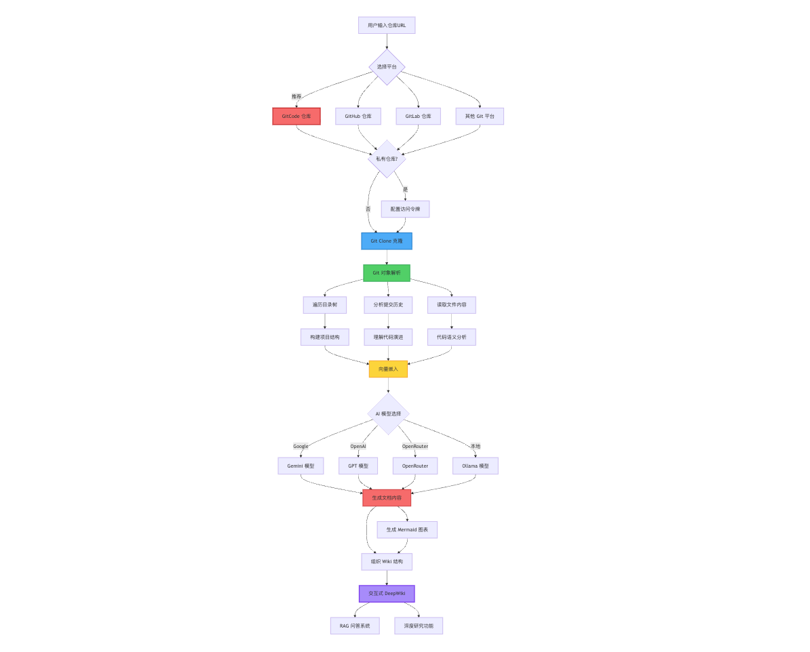
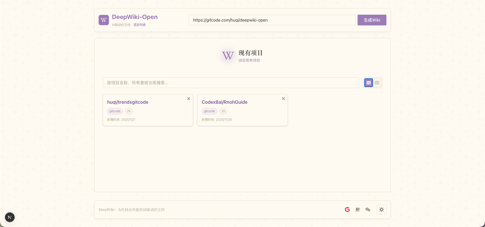
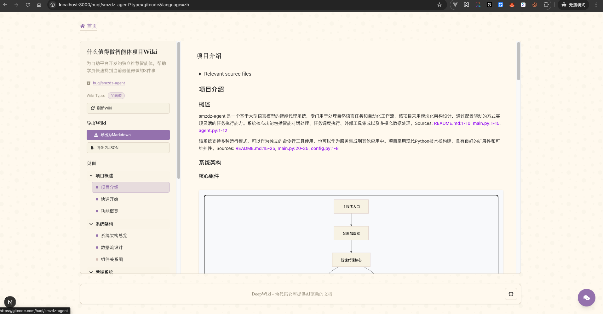
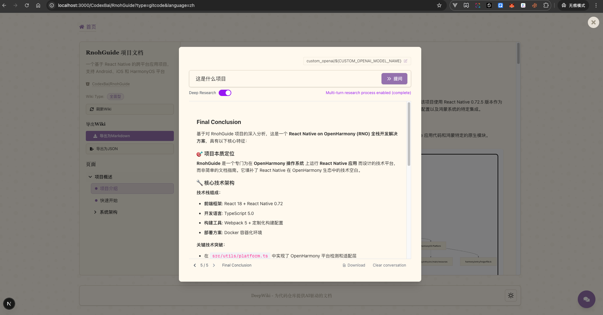

# DeepWiki-Open

> **🏆 Open Source Innovation Competition Entry** > **Topic 1: Practical Plugin and Application Development Based on Git Principles - Git Innovative Application Direction** > **Access URL: [https://gitcode.huqi.host/](https://gitcode.huqi.host/)**

## Project Name

**DeepWiki-Open** - An intelligent document generation tool based on Git principles, automatically creating beautiful, interactive Wiki documentation for **GitCode**, GitHub, GitLab, and any other Git repositories.

<video  width="640" height="360" controls>
   <source src="screenshots/deepwiki-gitcode.mp4">
   <source src="https://www.bilibili.com/video/BV1XrSWBjEvr/?share_source=copy_web&vd_source=28618d8b8e38d1775b1dc2ec9260545b">
</video>

## 📋 Competition Background and Project Positioning

### Competition Direction: Git Innovative Application (1.2.2)

DeepWiki-Open is an **innovative application based on Git principles**, focusing on solving core pain points in open source collaboration:

- **Pain Point 1: Missing Documentation**: Many excellent open source projects are difficult to promote due to a lack of comprehensive documentation.
- **Pain Point 2: Difficult to Understand**: New contributors find it hard to quickly understand the codebase structure and design philosophy.
- **Pain Point 3: Low Collaboration Efficiency**: Team members spend a lot of time reading and understanding code.

### Innovative Implementation Based on Git Principles

DeepWiki-Open deeply utilizes core Git features:

1. **Git Repository Cloning & Analysis**: Clones repositories based on Git protocols, supporting both public and private repository access.
2. **Git History Tracking**: Analyzes commit history to understand code evolution and key modules.
3. **Branch Structure Visualization**: Automatically identifies project structure, generating architecture diagrams and dependency relationships.
4. **Multi-Platform Compatibility**: Natively supports **GitCode**, GitHub, GitLab, Bitbucket, and all other Git-based code hosting platforms.

### Practical Value

- ⚡ **Lower Open Source Entry Barrier**: Automatically generated Wikis allow newcomers to quickly understand the project.
- 🤖 **AI-Driven Understanding**: Intelligent Q&A via RAG technology to answer code-related questions.
- 📊 **Visual Presentation**: Mermaid charts intuitively display code structure and data flow.
- 🔍 **Deep Research Capability**: Multi-round research mechanism to thoroughly analyze complex technical issues.

## ✨ Key Features

### 🎯 GitCode Priority Support

- **GitCode Native Integration**: Perfect support for public and private repositories on the GitCode platform.
- **Access Token Authentication**: Secure access to GitCode private repositories.
- **Chinese Community Optimization**: Documentation generation and Q&A experience optimized for the Chinese open source community.

### 🚀 Powerful Functions

- **Instant Documentation Generation**: Convert any Git repository into a professional Wiki document in seconds.
- **Private Repository Support**: Securely access private repositories using Personal Access Tokens.
- **AI Intelligent Analysis**: Understanding of code structure and relationships based on Large Language Models.
- **Automatic Chart Generation**: Create Mermaid charts to visualize architecture and data flow.
- **Intelligent Navigation**: Simple, intuitive interface for quick documentation exploration.
- **RAG Q&A System**: Retrieval-Augmented Generation technology to accurately answer code-related questions.
- **Deep Research Mode**: Multi-round iterative research to thoroughly investigate complex topics.
- **Multi-Model Support**: Supports Google Gemini, OpenAI, OpenRouter, and local Ollama models.

## Prerequisites

### API Key Requirements

- Google API Key (Get from [Google AI Studio](https://makersuite.google.com/app/apikey))
- OpenAI API Key (Get from [OpenAI Platform](https://platform.openai.com/api-keys))
- OpenRouter API Key (Optional, for using OpenRouter models)
- **GitCode Access Token** (Recommended, for accessing GitCode private repositories)

### Software Dependencies

- Python 3.8+ and pip
- Node.js 16+ and npm/yarn
- Docker and Docker Compose (if using Docker method)
- Git

### System Requirements

- At least 4GB RAM
- Sufficient disk space to store cloned repositories and generated embedding files

## Running Instructions

### 🚀 Quick Start (Recommended using Docker)

```bash
# 1. Clone the repository
git clone https://gitcode.com/huqi/deepwiki-open.git
cd deepwiki-open

# 2. Create .env file containing API keys
echo "CUSTOM_OPENAI_API_KEY=your_custom_api_key" > .env
echo "CUSTOM_OPENAI_BASE_URL=your_base_url" >> .env
echo "CUSTOM_OPENAI_MODEL_NAME=your_model_name" >> .env
echo "CUSTOM_OPENAI_EMBEDDING_MODEL=your_embedding_model" >> .env
echo "DEEPWIKI_EMBEDDER_TYPE=custom_openai" >> .env


# 3. Run using Docker Compose
docker-compose up
```

> 💡 **Data Persistence Note:** Docker configuration mounts the `~/.adalflow` directory to persist:
>
> - Cloned repositories (`~/.adalflow/repos/`)
> - Embeddings and indices (`~/.adalflow/databases/`)
> - Cached Wiki content (`~/.adalflow/wikicache/`)

### 📦 Method 2: Manual Setup (Recommended for Development)

#### Step 1: Set API Keys

Create a `.env` file in the project root directory:

```bash
# Required API Keys (Configure at least one)
# GOOGLE_API_KEY=your_google_api_key
# OPENAI_API_KEY=your_openai_api_key
CUSTOM_OPENAI_API_KEY=your_custom_api_key
CUSTOM_OPENAI_BASE_URL=your_base_url
CUSTOM_OPENAI_MODEL_NAME=your_model_name
CUSTOM_OPENAI_EMBEDDING_MODEL=your_embedding_model
DEEPWIKI_EMBEDDER_TYPE=custom_openai


# Optional Configuration
OPENROUTER_API_KEY=your_openrouter_api_key
OPENAI_BASE_URL=https://custom-api-endpoint.com/v1  # Optional, for custom OpenAI API endpoint
```

#### Step 2: Start Backend

```bash
# Install Python dependencies
python -m pip install poetry==2.0.1 && poetry install

# Activate virtual environment and start API server
source .venv/bin/activate && .venv/bin/python -m api.main
```

> 💡 Backend API server will start at `http://localhost:8001`

#### Step 3: Start Frontend

```bash
# Install JavaScript dependencies
npm install
# Or use yarn
yarn install

# Start Web Application
npm run dev
# Or use yarn
yarn dev
```

> 💡 Frontend application will start at `http://localhost:3000`

#### Step 4: Use DeepWiki

1. Open [http://localhost:3000](http://localhost:3000) in your browser.
2. Enter the Git repository URL, **Recommend trying GitCode repositories first**:
   - GitCode Public Repo Example: `https://gitcode.com/huqi/deepwiki-open`
   - GitHub Repo Example: `https://github.com/openai/whisper`
   - GitLab Repo Example: `https://gitlab.com/gitlab-org/gitlab`
3. For private repositories, click **"+ Add Access Token"** and enter your Personal Access Token.
4. Select an AI model provider and specific model.
5. Click **"Generate Wiki"** and witness AI automatically generating documentation!

### 🎯 GitCode Repository Usage Examples

#### Example 1: Generate Documentation for GitCode Public Repository

```
Repo URL: https://gitcode.com/huqi/deepwiki-open
Access Token: (Not required for public repos)
```

#### Example 2: Generate Documentation for GitCode Private Repository

```
Repo URL: https://gitcode.com/your-username/your-private-repo
Access Token: Access token created in GitCode personal settings
```

> 💡 **How to get GitCode Access Token:**
>
> 1. Login to GitCode
> 2. Go to **Personal Settings** → **Access Tokens**
> 3. Create a new token, select `read_repository` permission
> 4. Copy the generated token (shown only once)

### Environment Variables Explanation

```bash
# ====== API Keys (At least one required) ======
GOOGLE_API_KEY=your_google_api_key        # Required for Google Gemini models
OPENAI_API_KEY=your_openai_api_key        # Required for OpenAI models or used for embeddings
OPENROUTER_API_KEY=your_openrouter_api_key # Required for OpenRouter models
CUSTOM_OPENAI_API_KEY=your_custom_api_key # Custom custom_openai key

# Embedding Service (Can be different baseurl)
EMBEDDING_API_KEY=YOUR_EMBEDDING_API_KEY
EMBEDDING_BASE_URL=https://api.modelarts-maas.com/v1
EMBEDDING_MODEL_NAME=bge-m3

# ====== OpenAI API Base URL Configuration (Optional) ======
OPENAI_BASE_URL=https://custom-api-endpoint.com/v1

# ====== Configuration Directory (Optional) ======
DEEPWIKI_CONFIG_DIR=/path/to/custom/config/dir

# ====== Auth Mode (Optional) ======
DEEPWIKI_AUTH_MODE=true              # Enable auth mode
DEEPWIKI_AUTH_CODE=your_secret_code  # Auth code
```

## Testing Instructions

### Basic Functionality Testing

1. **Public Repo Test**: Enter a public GitHub/GitLab/GitCode repository URL to verify Wiki generation function.
2. **Private Repo Test**: Use an access token to test Wiki generation for private repositories.
3. **Q&A Function Test**: Use the Q&A function in the generated Wiki to verify RAG Q&A.
4. **Deep Research Test**: Enable deep research mode to test multi-round research capabilities.

### Troubleshooting

#### API Key Issues

- **"Missing Environment Variables"**: Ensure `.env` file is in the project root and contains required API keys.
- **"Invalid API Key"**: Check if you copied the full key correctly without extra spaces.

#### Connection Issues

- **"Cannot Connect to API Server"**: Ensure API server is running on port 8001.
- **"CORS Error"**: Try running frontend and backend on the same machine.

#### Generation Issues

- **"Error Generating Wiki"**: For very large repositories, try smaller ones first.
- **"Invalid Repository Format"**: Ensure you are using a valid repository URL format.
- **"Cannot Get Repository Structure"**: Verify access token validity and permissions.

#### Common Solutions

1. Restart frontend and backend servers.
2. Check browser console logs for JavaScript errors.
3. Check API terminal for Python error logs.

## Technical Architecture

### 🔧 Core Design Based on Git Principles

DeepWiki-Open deeply integrates Git core mechanisms to achieve intelligent document automation:

#### 1. Git Protocol Integration

- **Git Clone Mechanism**: Uses standard Git protocols to clone repositories, supporting HTTP(S), SSH, etc.
- **Authentication System**: Supports Personal Access Token (PAT) authentication for secure private repository access.
- **Multi-Platform Adaptation**: Unified interface supporting GitCode, GitHub, GitLab, Bitbucket, and all Git hosting platforms.

#### 2. Git Object Model Analysis

- **Blob Object Parsing**: Reads file content, identifying code language and structure.
- **Tree Object Traversal**: Analyzes directory tree structure, building project file hierarchy.
- **Commit History Tracking**: Analyzes commit records to understand code evolution process.
- **Reference Identification**: Identifies branches, tags, and other references to understand project version layout.

#### 3. Code Semantic Understanding

- **AST Extraction**: Parses Abstract Syntax Trees of source code to understand code structure.
- **Dependency Graph**: Builds module dependency relationships based on import/include statements.
- **Vector Embedding**: Converts code snippets into vector representations to support semantic retrieval.

#### 4. AI-Driven Document Generation

- **RAG Technology**: Retrieval-Augmented Generation, producing accurate documentation based on actual code.
- **Multi-Model Support**: Integrates mainstream LLMs like Google Gemini, OpenAI, OpenRouter.
- **Context Window Management**: Intelligently slices and organizes code context to optimize AI understanding.

### 📊 System Workflow



### 💻 System Architecture Components

```
deepwiki-open/
├── api/                  # Backend API Server
│   ├── main.py           # API Entry Point
│   ├── api.py            # FastAPI Implementation
│   ├── rag.py            # Retrieval-Augmented Generation
│   ├── data_pipeline.py  # Data Processing Tools
│   └── config/           # Configuration Directory
│       ├── generator.json    # Text Generation Model Config
│       ├── embedder.json     # Embedding Model Config
│       └── repo.json         # Repository Processing Config
│
├── src/                  # Frontend Next.js App
│   ├── app/              # Next.js App Directory
│   │   └── page.tsx      # Main App Page
│   └── components/       # React Components
│       └── Mermaid.tsx   # Mermaid Chart Renderer
│
├── public/               # Static Assets
├── package.json          # JavaScript Dependencies
└── .env                  # Environment Variables (Need to create)
```

### Tech Stack

- **Frontend**: Next.js, React, TypeScript
- **Backend**: Python, FastAPI
- **AI Models**: Google Gemini, OpenAI, OpenRouter, Ollama
- **Vector Store**: Embedded vector database for RAG
- **Visualization**: Mermaid.js charts

### Core Features

#### Q&A Function (RAG Driven)

- Context-Aware Responses: Accurate answers based on actual repository code.
- RAG Driven: Retrieves relevant code snippets to provide grounded responses.
- Real-time Streaming: View generated responses in real-time.
- Conversation History: Maintains context for coherent interaction.

#### Deep Research Function

- In-depth Investigation: Thoroughly explore complex topics through multiple iterations.
- Structured Process: Follows a clear research plan.
- Auto-Continue: AI automatically continues research until a conclusion is reached (max 5 iterations).
- Research Stages: Research Plan → Research Update → Final Conclusion.

### Multi-Model Support

#### Supported Providers and Models

- **Google**: `gemini-2.5-flash` (Default), `gemini-2.5-flash-lite`, `gemini-2.5-pro`, etc.
- **OpenAI**: `gpt-5-nano` (Default), `gpt-5`, `4o`, etc.
- **OpenRouter**: Access Claude, Llama, Mistral, and more via unified API.
- **Ollama**: Supports locally running open-source models like `llama3`.

#### Configuration Files

1. **`generator.json`**: Text generation model configuration

   - Defines available model providers.
   - Specifies default and available models for each provider.
   - Includes model-specific parameters (temperature, top_p).

2. **`embedder.json`**: Embedding model and text processing configuration

   - Defines embedding models used for vector storage.
   - Includes retriever configuration for RAG.
   - Specifies text splitter settings for document chunking.

3. **`repo.json`**: Repository processing configuration
   - File filter configuration.
   - Repository size limits and processing rules.

### Auth Mode

DeepWiki supports an authorization mode to control who can use the generation feature:

- When enabled, the frontend displays an authorization code input field.
- Restricts using the frontend page to generate Wikis and protects cached generated pages from deletion.
- Primarily intended to protect Wiki pages already generated by administrators.

### 🤖 Custom LLM Support

DeepWiki-Open provides flexible custom LLM configuration capabilities, supporting any Large Language Model service compatible with the OpenAI API format.

#### Method 1: Using Custom OpenAI Compatible Endpoint

By configuring the `OPENAI_BASE_URL` environment variable, you can use any service compatible with the OpenAI API:

```bash
# .env file configuration
OPENAI_API_KEY=your_custom_api_key
OPENAI_BASE_URL=https://your-custom-endpoint.com/v1

# Example: Using Aliyun Bailian Platform
OPENAI_BASE_URL=https://dashscope.aliyuncs.com/compatible-mode/v1

# Example: Using Zhipu AI
OPENAI_BASE_URL=https://open.bigmodel.cn/api/paas/v4

# Example: Using SiliconFlow
OPENAI_BASE_URL=https://api.siliconflow.cn/v1
```

After configuration, select the "OpenAI" provider in the frontend to use models from the custom endpoint.

#### Method 2: Directly Input Custom Model in Interface

DeepWiki supports directly inputting custom model identifiers in the frontend interface:

1. In the model selection dialog, enable the **"Custom Model"** option.
2. Enter your custom model name (e.g., `qwen-plus`, `glm-4`).
3. Ensure the corresponding API Key and BASE_URL are correctly configured.

#### Supported Custom LLM Providers

✅ **Mainstream Chinese AI Platforms**

- Aliyun Bailian (Qwen Series)
- Zhipu AI (GLM Series)
- Baidu Qianfan (ERNIE Bot)
- ByteDance Doubao
- Moonshot AI (Kimi)
- DeepSeek
- 01.AI (Yi Series)

✅ **Open Source Model Hosting Platforms**

- SiliconFlow
- Together AI
- Replicate
- Hugging Face Inference API

✅ **Private Deployment**

- Models deployed via vLLM
- Models deployed via FastChat
- Text Generation Inference (TGI)
- Local Ollama (No BASE_URL configuration needed)

#### Custom Embedding Model

If you need to use a custom embedding model (e.g., Alibaba Qwen Embedding):

1. Replace `api/config/embedder.json` with `api/config/embedder_openai_compatible.json`.
2. Configure in `.env` file:
   ```bash
   OPENAI_API_KEY=your_embedding_api_key
   OPENAI_BASE_URL=https://your-embedding-endpoint.com/v1
   ```
3. The program will automatically use the configured endpoint for vectorization.

#### Configuration Customization

Advanced users can directly modify configuration files to add new model providers:

**Edit `api/config/generator.json`**:

```json
{
  "providers": {
    "custom_provider": {
      "default_model": "your-model-name",
      "available_models": ["your-model-name", "another-model"],
      "model_kwargs": {
        "temperature": 0.7,
        "top_p": 0.9
      }
    }
  }
}
```

### Auth Mode

DeepWiki supports an authorization mode to control who can use the generation feature:

- When enabled, the frontend displays an authorization code input field.
- Restricts using the frontend page to generate Wikis and protects cached generated pages from deletion.
- Primarily intended to protect Wiki pages already generated by administrators.

Configuration method:

```bash
DEEPWIKI_AUTH_MODE=true              # Enable auth mode
DEEPWIKI_AUTH_CODE=your_secret_code  # Set auth code
```

## 🏆 Competition Entry Highlights Summary

### Meeting Competition Requirements (Git Innovative Application 1.2.2)

**✅ Based on Git Principles**

- Deeply integrates core mechanisms like Git Clone, Object Model, History Tracking.
- Supports standard Git transport protocols like HTTP(S), SSH.
- Natively supports all Git platforms like GitCode, GitHub, GitLab.

**✅ Practical Value**

- Solves the pain point of missing open source project documentation.
- Lowers the barrier to open source participation, helping newcomers understand code quickly.
- AI-driven intelligent Q&A system improves collaboration efficiency.

**✅ Innovativeness**

- First AI automated documentation generation based on Git repositories.
- RAG technology enables precise code Q&A.
- Multi-round deep research mechanism thoroughly analyzes complex problems.

### Technical Innovations

#### 1️⃣ Deep Git Integration

- **Git Object Model Analysis**: Parses Blob, Tree, Commit objects to understand code structure.
- **Intelligent Repository Cloning**: Supports public/private repositories, unified multi-platform authentication.
- **Commit History Analysis**: Tracks code evolution, identifies key modules.

#### 2️⃣ AI Intelligent Enhancement

- **RAG Technology**: Retrieval-Augmented Generation, generating documentation based on actual code.
- **Multi-Model Support**: Google Gemini, OpenAI, OpenRouter, Ollama.
- **Custom LLM**: Supports any OpenAI-compatible API endpoint.

#### 3️⃣ GitCode Priority Adaptation

- Default selection of GitCode platform.
- Specifically optimized for GitCode private repository access.
- Specifically optimized for GitCode private repository access.

#### 4️⃣ Visualization Enhancement

- Automatically generates Mermaid architecture diagrams and data flow charts.
- Interactive Wiki interface, easy to navigate.
- Code structure and dependency relationship visualization.

### Practical Application Scenarios

🔹 **Open Source Project Maintainers**

- Automatically generate project documentation, reducing maintenance costs.
- Attract more contributors to participate.

🔹 **Developer Learning**

- Quickly understand the architecture and design of new projects.
- Learn code details in depth through the Q&A system.

🔹 **Enterprise Teams**

- Private repository documentation automation.
- Team knowledge base construction.
- Code review auxiliary tool.

🔹 **Education and Training**

- Code teaching auxiliary tool.
- Open source project case analysis.
- Git principle practice demonstration.

### Competitive Advantage

| Feature              | DeepWiki-Open       | Traditional Doc Tools |
| -------------------- | ------------------- | --------------------- |
| Automation Level     | ✅ Fully Automatic  | ❌ Manual Writing     |
| Git Integration      | ✅ Deep Integration | ⚠️ Basic Support      |
| AI Q&A               | ✅ RAG Driven       | ❌ None               |
| Visualization        | ✅ Automatic Charts | ⚠️ Manual Drawing     |
| Private Repo         | ✅ Fully Supported  | ⚠️ Partial Support    |
| Multi-Model          | ✅ 4+ Providers     | ❌ Single or None     |
| GitCode Optimization | ✅ Priority Support | ❌ None               |

## Collaborators

Contributions are welcome! You can participate in the following ways:

- Open issues for bugs or feature requests.
- Submit pull requests to improve code.
- Share your feedback and ideas.

---

### License

This project is licensed under the MIT License - see the [LICENSE](LICENSE) file for details.

### Screenshots


_DeepWiki Main Interface_


_Accessing Private Repositories using Personal Access Token_


_Deep Research for Multi-round Investigation of Complex Topics_
